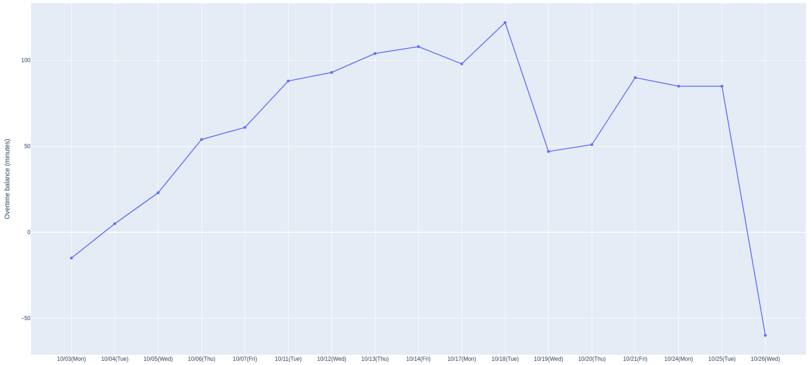

# Jobcant

## Installation

```
pip install jobcant
jobcant config
```

## Usage

### Overtime balance

```shell
$ jobcant balance
Monthly overtime balance: -01:00
Weekly overtime balance: -02:30

Last day:
  Clock-in: 09:21
  Working hours: 05:35
  Break: 
```

### Overtime balance graph

```shell
$ jobcant graph
```



## Config

### Environment variables

- `JOBCAN_EMAIL`
- `JOBCAN_CLIENT_CODE`
- `JOBCAN_PASSWORD`

### Config file

```
jobcant config
```

## Build

```
python -m build
```
